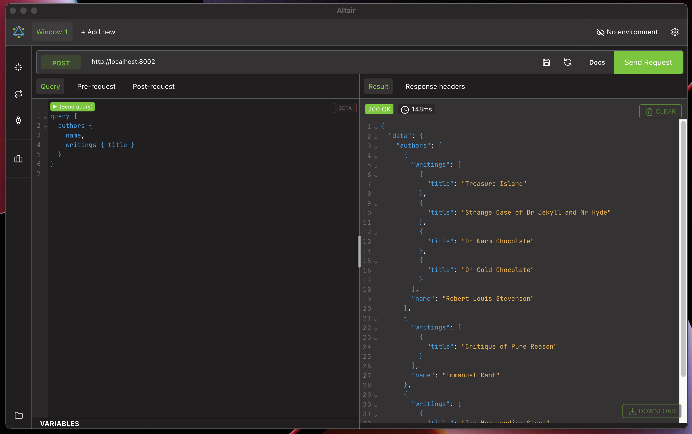

# mu-haskell-berlin-fp-talk



Code example and slides for my talk in the Berlin Functional Programming Group 🇩🇪

```sh
$ stack run library
```

## Compile slides (Node required)

```sh
$ cd slides && npm i && npm start
```
